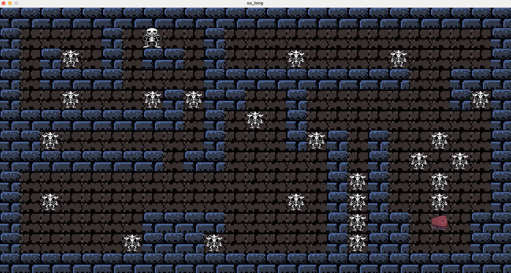
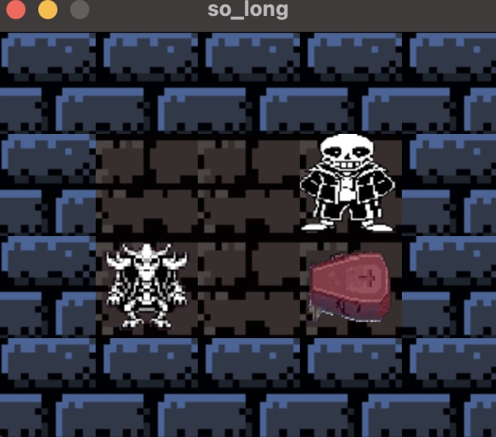

	███████╗ ██████╗         ██╗      ██████╗ ███╗   ██╗ ██████╗ 
	██╔════╝██╔═══██╗        ██║     ██╔═══██╗████╗  ██║██╔════╝ 
	███████╗██║   ██║        ██║     ██║   ██║██╔██╗ ██║██║  ███╗
	╚════██║██║   ██║        ██║     ██║   ██║██║╚██╗██║██║   ██║
	███████║╚██████╔╝███████╗███████╗╚██████╔╝██║ ╚████║╚██████╔╝
	╚══════╝ ╚═════╝ ╚══════╝╚══════╝ ╚═════╝ ╚═╝  ╚═══╝ ╚═════╝ 
---

<p align="center">
  
</p>

# So Long 🕹️

This project is part of the **42 School** curriculum. It is the fifth project, although it is the first graphic project in the Cursus. The project aims to create a `2D video game` using the graphic library `MiniLibX` from the campus and the C language.

## Project Description 📖

In this project, I use the ``MiniLibX`` graphic library to create a window, manipulate images, and work with keyboard events. This library is a reduced and adapted version of ``OpenGL``.

It involves a series of validations for the map passed as an argument, checks to prevent memory leaks, game engineering, managing windows, events, sprites, and maps.

## Requisites ⚠️

If you want to download my repo and try it out, you must consider your operating system.

- 🍎 Macos

- Download the dependencies:

## Usage 🤟

Once compiled, run the program, and you can interact with the window using the keyboard.

1. Clone this repository to your local machine.
```bash
git clone https://github.com/alexhiguera/So_long.git
```
2. Download the dependencies:
```BASH
git submodule init
git submodule update
```
3. Run the compilation command to generate the executable and run game:
```bash
make play
```

## Sprites 🎞️

The images of the sprites must be in ``.xpm`` format. If you want to create your sprites, follow these steps:

1. **Find** or **create** sprites in any image format.
2. Resize them in any editing program to ``64px x 64px``.
(``64px`` is not arbitrary; my project is defined like that, check what you need in your case).
3. Transform to the ``.xpm`` format through [Convertio](https://convertio.co/es/png-xpm/).

## Controls 🎮


| KEY 		 |	OBJECT   		 |
| -----------|------------------ |
| `W` or ⬆️	 |    Move up  		 |
| `A` or ⬅️  |    Move left 	 |
| `S` or ⬇️  |    Move down  	 |
| `D` or ➡️   |   Move right	  |      
| `Q` or Esc |   Close the game  | 

## Map 🗺️

You can create another map if you wish, as it can analyze any type of map, as long as it follows these rules:

- The map must be a .ber file.
- It can only contain these characters:
- It must be rectangular and surrounded by walls.
- The map must contain at least one exit, one collectible, and an initial position.


|	OBJECT    | CHAR 	  |
| ------------| --------- |
|   Wall      | 1         |
|   Coin      | C	      |
|   Exit      | E	      |
|   Player    | P         |      
|   Floor     | 0         |

*See some examples in the /assets/maps folder 🗺️.*

ejemplo:

	11111111111
	10C0P1C0011
	10000100001
	1C0000C0001
	111C01E00C1
	11111111111

<p align="center">
  
</p>